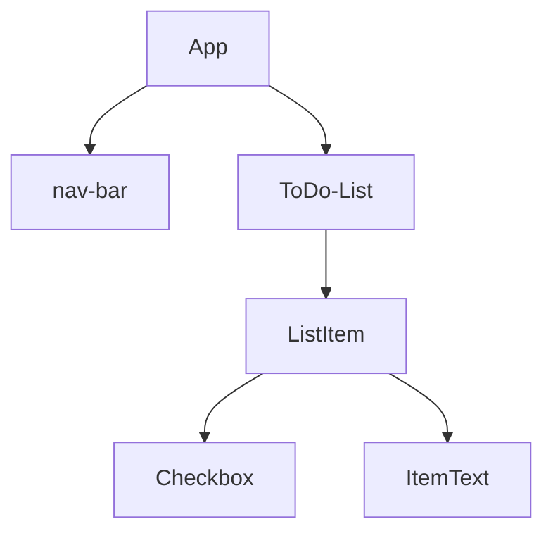
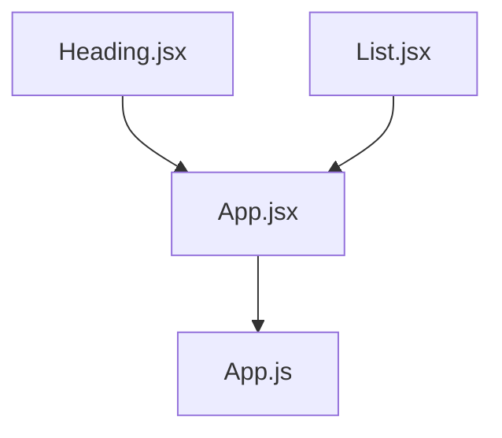

# React

## 391. What is React?

um framework javascript 

uma estrutura básica seria



um sistema de componentização que facilita a estrutura do codigo

## 392. What we will make in this React module

mostrando o que vai ser feito no capitulo

## 393. Introduction to Code Sandbox and the Structure of the Module

`https://codesandbox.io` online pra usar react e instalar dependencias faceis

falando que vao ser usado o codesandbox por um tempo depois passa pro vscode

fazer fork do projeto no seu github

## 394. Introduction to JSX and Babel

começa com instalando as dependencias de `react` e `react-dom`

no react tem o render, que tem a seguinte sintaxe

`ReactDOM.render("O QUE MOSTRAR", "ONDE MOSTRAR", callback());`

```html
<div id="root"></div>
```

```react
ReactDOM.render(<h1>Hello World</h1>, document.getElementById("root"));
```

um comparativo de vanilla dom pra react seria

```react
ReactDOM. render( <h1> Hello World </h1>, document.getElementById("root"));
                 
var h1 =
document.createElement("h1");
h1.innerHTML = "Hello World!";
document.getElementById("root").appendChild(h1);
```

**Babel faz uma conversão de um codigo JS para um que todos os navegadores possam entender**

o `.render()` so renderiza um elemento, mas quando quiser por 2 tem como usar `div` para ter somente um grande elemento HTML

```react
ReactDOM.render(
  <div>
    <h1>Hello World</h1>
    <p>Bem vindo</p>
  </div>,
  document.getElementById("root")
);
```

## 395. JSX Code Practice

fazer um pequeno site com h1 e uma lista nao ordenada usando react

```react
import React from "react";
import ReactDOM from "react-dom";

ReactDOM.render(
  <div>
    <h1>My favourite foods</h1>
    <ul>
      <li>French Fries</li>
    </ul>
  </div>,
  document.getElementById("root")
);
```

## 396. Javascript Expressions in JSX & ES6 Template Literals

falando sobre JSX deixar por html no JS, mas que pode tbm por JS dentro do HTML que está dentro do JS.

para chamar uma variável basta por {} com a variável dentro, assim como qualquer expressão.
_vídeo sobre expression x statement_

```react
const name = "Jefté"
ReactDOM.render(
  <div>
    <h1>Hello World, {name}</h1>
    <p>Bem vindo</p>
  </div>,
  document.getElementById("root")
);
```

para usar statement tem que escrever antes do render e jogar o resultado já dentro do `.render()`

## 397. Javascript Expressions in JSX Practice

```react
import React from "react";
import React DOM from "react-dom";
const name = "Angela";
const current Date = new Date();
const year = currentDate.getFullYear();
ReactDOM. render(
<div>
	<p>Created by {name}</p>
	<p>Copyright {year}</p>
</div>,
document.getElementById("root")
);
```

## 398. JSX Attributes & Styling React Elements

quando criando um html no `.render()` ao atribuir classe a um elemento nao deve se usar `class=""`, mas sim `className=""`

```react
<h1 className="NomeDaClasse">Conteúdo</h1>
```

ao fazer isso vc passa o JSX.
E ao passar JSX, haverá um erro no seu console ja que na tag <script></script> que importa o arquivo .js no seu html terá um `type=text/javascript`
nesse caso, deve-se mudar para `type="text/JSX"`

ao passar atributos cmo classe vc pode ajustar o css de acordo com as classes e ids que estão presentes no JSX e no arquivo do CSS

global atributes HTML, que podem ser usados em qualquer tag

## 399. Inline Styling for React Elements

para criar inline css tem que passar como um objeto

```react
 <h1 style={{ color: "red"}}>Hello World!</h1>.
```

outro exemplo de como passar e atualizar o objeto seria

```react
const customStyle = {
	color: "red",
	fontSize: "20px",
	border: "1px solid black"
}
customStyle.color = "blue":

ReactDOM. render(
	<h1 style={customStyle}>Hello World!</h1>,
	document.getElementById("root")
);
```

## 400. React Styling Practice

prática de estilização dando bom dia, boa tarde ou boa noite dependendo da hora

```react
import React from "react";
import ReactDOM from "react-dom";

const date = new Date();
const currentTime = date.getHours();

let greeting;

const customStyle = {
  color: ""
};

if (currentTime < 12) {
  greeting = "Good Morning";
  customStyle.color = "red";
} else if (currentTime < 18) {
  greeting = "Good Afternoon";
  customStyle.color = "green";
} else {
  greeting = "Good Night";
  customStyle.color = "blue";
}

ReactDOM.render(
  <h1 className="heading" style={customStyle}>
    {greeting}
  </h1>,
  document.getElementById("root")
);

//Create a React app from scratch.
//Show a single h1 that says "Good morning" if between midnight and 12PM.
//or "Good Afternoon" if between 12PM and 6PM.
//or "Good evening" if between 6PM and midnight.
//Apply the "heading" style in the styles.css
//Dynamically change the color of the h1 using inline css styles.
//Morning = red, Afternoon = green, Night = blue.

```

## 401. React Components

componentização seria como o EJS, arquivos separados de React seriam chamados em outro arquivo reunindo essas partes quando necessário. 



como fica o List

```react
import React from "react";

function List() {
  return (
    <ul>
      <li>Bacon</li>
      <li>Jamon</li>
      <li>Noodles</li>
    </ul>
  );
}

export default List;

```

como fica o Heading

```react
import React from "react";

function Heading() {
  return <h1>My Favourite Foods</h1>;
}

export default Heading;

```

como fica o app.jsx

```react
import React from "react";
import Heading from "./Heading";
import List from "./List";

function App() {
  return (
    <div>
      <Heading />
      <List />
      <List />
    </div>
  );
}

export default App;

```

como fica o index.js chamando o app.jsx

```react
import React from "react";
import ReactDOM from "react-dom";
import App from "./components/App";

ReactDOM.render(<App />, document.getElementById("root"));

```

## 402. React Components Practice

`https://codesandbox.io/s/react-components-practice-completed-2ksvn?fontsize=14&hidenavigation=1&theme=dark&file=/src/index.js`

## 403. Javascript ES6 - Import, Export and Modules

em um arquivo `src/math.js`, sendo src uma pasra de resources hipotética, há uma constante `const pi = 1.14159`

no final do arquivo há `export default pi;`

para acessar tal variável,  fazemos o import no começo do arquivo que queremos usar o pi

`import pi from ".math/js"`

basicamente da mesma forma que se cria um package interno do express

mas como faria com mais de 1 dado?

```js
const pi = 3.1415962;
function doublePi() {
return pi* 2;
function triplePi() {
return pi * 3;
export default pi;
export {doublePi, tripleP}:


```

```react
import React from "react";
import ReactDOM from "react-dom";
import PI, {doublePi, triplePi} from ". /math.js":
// PI pode ser qualquer coisa, mas as variáveis dentro dos colchetes tem que ser a mesma do arquivo a ser exportado
ReactDOM. render(
	<ul>
		<li>{PI}</1i>
		<li>{doublePi()}</li>
		<li>{triplePi()}</li>

</ul>,
document.getElementById("root")
);
//pi era uma variavel e as outras 2 eram metodos
```

ou de forma mais fácil, usar `import * as pi from "./math.js";` e chamar as variaveis como `pi.default`, para o valor de pi e `pi.doublePi()` para o método de pi*2

## 404. Javascript ES6 Import, Export and Modules Practice

```react
import React from "react";
import ReactDOM from "react-dom";
import { add, subtract, multiply, divide } from "./calculator";


ReactDOM.render(
  <ul>
    <li>{add(1, 2)}</li>
    <li>{multiply(2, 3)}</li>
    <li>{subtract(7, 2)}</li>
    <li>{divide(5, 2)}</li>
  </ul>,
  document.getElementById("root")
);

```

## 405. [Windows] Local Environment Setup for React Development

no terminal digitar `npx create-react-app my-app`

ir na pasta `my-app` e rodar `npm start`

o hello world

```react
import React from 'react';
import ReactDOM from 'react-dom/client';

const root = ReactDOM.createRoot(document.getElementById('root'));
root.render(
  <h1>Hello, world!</h1>
);
```

## 408. Keeper App Project - Part 1 Challenge

1. Create a new React app.
2.  Create a App.jsx component
3.  Create a Header.jax component that renders a `<header>` element
   //to show the Keeper App name in an `<h1>`
4.  Create a Footer.jsx component that renders a `<footer>` element
   //to show a copyright message in a <p> with a dynamically updated year.
5.  Create a Note.jsx component to show a <div> element with a
   //`<h1>` for a title and a `<p>` for the content.
6.  Make sure that the final website is styled like the example shown here:
   //https://w00gz.csb.app/
   //HINT: You will need to study the classes in teh styles.cos file to appy styling.

## 410. React Props

faland sobre elementos repetitivos e como react é útil pra isso

os componentes, `<component />`, podem receber propriedades como um elemento HTML e passar esses valores pra função que faz aquele componente, como uma função que recebe parametros.

```react
function Card(props) {
  return (
    <div>
      <h2>{props.name}</h2>
      
      <p>{props.tel}</p>
      <p>{props.email}</p>
    </div>
  );
}

ReactDOM.render(
  <div>
    <h1>My Contacts</h1>
    <Card
      name="Beyonce"
      img="https://blackhistorywall.files.wordpress.com/2010/02/picture-device-independent-bitmap-119.jpg"
      tel="+123 456 789"
      email="b@beyonce.com"
    />
    <Card
      name="Jack Bauer"
      img="https://pbs.twimg.com/profile_images/625247595825246208/X3XLea04_400x400.jpg"
      tel="+7387384587"
      email="jack@nowhere.com"
    />
  </div>,
  document.getElementById("root")
);

```

## 411. React Props Practice

usando props com um objeto js de uma outra pasta

`https://codesandbox.io/s/react-props-practice-completed-c6fkx?fontsize=14&file=/src/components/App.jsx`

## 412. React DevTools

extensão `React DevTools`

`https://codesandbox.io/s/react-devtools-completed-wku4k?fontsize=14&file=/src/components/Card.jsx`

codigo final outro exemplo de componentização

## 413. Mapping Data to Components

```jsx
import React from "react";
import Card from "./Card";
import contacts from "../contacts";

function createCard(contact) {
  return (
    <Card
      key={contact.id} // contact é o arquivo externo
      name={contact.name}
      img={contact.imgURL}
      tel={contact.phone}
      email={contact.email}
    />
  );
}

function App() {
  return (
    <div>
      <h1 className="heading">My Contacts</h1>
      {contacts.map(createCard)}
    </div>
  );
}

export default App;

```

## 414. Mapping Data to Components Practice

pegar as partes que repetem pra fazer o componente
criar propriedades

**passo 1** - Criar componente da parte que repete:

```jsx
import React from "react";

function Entry(props) {
  return (
    <div className="term">
      <dt>
        <span className="emoji" role="img" aria-label="Tense Biceps">
          💪
        </span>
        <span>Tense Biceps</span>
      </dt>
      <dd>
        “You can do that!” or “I feel strong!” Arm with tense biceps. Also used
        in connection with doing sports, e.g. at the gym.
      </dd>
    </div>
  );
}
export default Entry;

```

```jsx
import React from "react";
import emojipedia from "../emojipedia.js";
import Entry from "./Entry";

function App() {
  return (
    <div>
      <h1>
        <span>emojipedia</span>
      </h1>
      <dl className="dictionary">
        <Entry />
      </dl>
    </div>
  );
}

export default App;

```

**passo 2** - fazer o entry receber as propriedades:

```jsx
//entry
import React from "react";

function Entry(props) {
  return (
    <div className="term">
      <dt>
        <span className="emoji" role="img" aria-label="Tense Biceps">
          {props.emoji}
        </span>
          <span>{props.name}</span>
      </dt>
      <dd>{props.description}</dd>
    </div>
  );
}
export default Entry;

```

```jsx
//App
import React from "react";

function Entry(props) {
  return (
    <div className="term">
      <dt>
        <span className="emoji" role="img" aria-label="Tense Biceps">
          {props.emoji}
        </span>
          <span>{props.name}</span>
      </dt>
      <dd>{props.description}</dd>
    </div>
  );
}
export default Entry;

```

Até o momento ja mostra o card

passo 3 - Criar a função de exibit card e um map do emojipedia

```jsx
import React from "react";
import emojipedia from "../emojipedia.js";
import Entry from "./Entry";

function createCard(emojipedia) {
  return (
    <Entry
      key={emojipedia.id}
      emoji={emojipedia.emoji}
      name={emojipedia.name}
      description={emojipedia.meaning}
    />
  );
}

function App() {
  return (
    <div>
      <h1>
        <span>emojipedia</span>
      </h1>
      <dl className="dictionary">{emojipedia.map(createCard)}</dl>
    </div>
  );
}

export default App;

```

## 415. Javascript ES6 Map/Filter/Reduce

refazer pq eu nao salvei quando fiz as anotações  e perdi 

:(

## 416. Javascript ES6 Arrow functions

## 417. Keeper App Project - Part 2

usar o arquivo json notes e renderizar as notas num componente com .map

## 418. React Conditional Rendering with the Ternary Operator & AND Operator

`contition ? ifTrue : ifFalse`

uso bastante importante pois é uma expressão, não um statement, ja que o JSX nao aceita statement 

## 419. Conditional Rendering Practice

renderizar um componente usando ternário

resumo, se tiver registrado aparece Login, se nao, aparece registrado.

` <button type="submit">{props.isRegistered ? "Login" : "Register"}</button>`

## 420. State in React - Declarative vs. Imperative Programming

exemplo imperativo

```jsx
import React from "react";

var isDone = false;

function strike() {
  isDone = true;
}

function unStrike() {
  isDone = false;
}

function App() {
  return (
    <div>
      <p style={isDone ? { textDecoration: "line-through" } : null}>Buy milk</p>
      <button onClick={strike}>Change to strike through</button>
      <button onClick={unStrike}>Change back</button>
    </div>
  );
}

export default App;

```

## 421. React Hooks - useState

```jsx
import React, { useState } from "react";
//useState pra nao ficar usando React.useState toda hora
function App() {
  const [count, setCount] = useState(0);
	//destructuring
	//useState tem um valor e uma função, o count pega o valor do useState, 0, e o setCount passa a função.
  function increase() {
    setCount(count + 1);//função passada
  }
  function decrease() {
    setCount(count - 1);
  }

  return (
    <div className="container">
      <h1>{count}</h1>
      <button onClick={decrease}>-</button>
      <button onClick={increase}>+</button>
    </div>
  );
}

export default App;

```

## 422. useState Hook Practice

```jsx
import React, { useState } from "react";

function App() {
  setInterval(upDate, 1000);

  let time = new Date().toLocaleTimeString();
  let [date, showDate] = useState("time");

  function upDate() {
    let newTime = new Date().toLocaleTimeString();
    showDate((date = newTime));
  }

  return (
    <div className="container">
      <h1>{date}</h1>
      <button onClick={upDate}>Get Time</button>
    </div>
  );
}

export default App;

```

## 423. Javascript ES6 Object & Array Destructuring

quando usando destucturing garantir que as variáveis são únicas

```jsx
 import animals from "./data";
console.log(animals);
const [cat, dog] = animals;
console.log(cat);
const { name: catName, sound: catSound } = cat;

console.log(catName)://log Cat

```

com nested objects

`const { name: catName, sound: catSound, feedingRequirements: {food, water} } = cat;`

## 424. Javascript ES6 Destructuring Challenge Solution

```jsx
const cars = [
  {
    model: "Honda Civic",
    coloursByPopularity: ["black", "silver"],
    speedStats: {
      topSpeed: 140,
      zeroToSixty: 8.5
    }
  },
  {
    model: "Tesla Model 3",
    coloursByPopularity: ["red", "white"],
    speedStats: {
      topSpeed: 150,
      zeroToSixty: 3.2
    }
  }
];

export default cars;

```

```jsx
import React from "react";
import ReactDOM from "react-dom";
import cars from "./practice";

const [honda, tesla] = cars;

const {
  speedStats: { topSpeed: hondaTopSpeed }
} = honda;
const {
  speedStats: { topSpeed: teslaTopSpeed }
} = tesla;

const {
  coloursByPopularity: [hondaTopColour]
} = honda;
const {
  coloursByPopularity: [teslaTopColour]
} = tesla;

ReactDOM.render(
  <table>
    <tr>
      <th>Brand</th>
      <th>Top Speed</th>
      <th>Top Colour</th>
    </tr>
    <tr>
      <td>{tesla.model}</td>
      <td>{teslaTopSpeed}</td>
      <td>{teslaTopColour}</td>
    </tr>
    <tr>
      <td>{honda.model}</td>
      <td>{hondaTopSpeed}</td>
      <td>{hondaTopColour}</td>
    </tr>
  </table>,
  document.getElementById("root")
);

```

## 425. Event Handling in React

```jsx
import React, { useState } from "react";

function App() {
  const [headingText, setHeadingText] = useState("Hello");
  const [isMousedOver, setMouseOver] = useState(false);

  function handleClick() {
    setHeadingText("Submitted");
  }
  function handleMouseOver() {
    setMouseOver(true);
  }
  function handleMouseOut() {
    setMouseOver(false);
  }
  return (
    <div className="container">
      <h1>{headingText}</h1>
      <input type="text" placeholder="What's your name?" />
      <button
        style={{ backgroundColor: isMousedOver ? "black" : "white" }}
        onClick={handleClick}
        onMouseOver={handleMouseOver}
        onMouseOut={handleMouseOut}
      >
        Submit
      </button>
    </div>
  );
}

export default App;

```

## 426. React Forms


```jsx
import React, { useState } from "react";

function App() {
  const [name, setName] = useState("");
  const [headingText, setHeading] = useState("");

  function handleChange(event) {
    console.log(event.target.value);
    setName(event.target.value);
  }

  function handleClick(event) {
    setHeading(name);

    event.preventDefault();
  }

  return (
    <div className="container">
      <h1>Hello {headingText}</h1>
      <form onSubmit={handleClick}>
        <input
          onChange={handleChange}
          type="text"
          placeholder="What's your name?"
          value={name}
        />
        <button type="submit">Submit</button>
      </form>
    </div>
  );
}

export default App;

```

## 427. Class Components vs. Functional Components

a ideia é basicamente a mesma, mas precisa extender, herdar, uma classe de react

```jsx
class App extends React.Component {
	render() {
		return <hl>Hello</hi>;
	}
}

export default App;
```

antes se usava mais classes por conta do state

basicamente o hooks veio pra acabar com isso

## 428 & 429. Changing Complex State

```jsx
import React, { useState } from "react";

function App() {
  const [contact, setContact] = useState({
    fName: "",
    lName: "",
    email: ""
  });

  function handleChange(event) {
    const { name, value } = event.target;

    setContact((prevValue) => {
      if (name === "fName") {
        return {
          fName: value,
          lName: prevValue.lName,
          email: prevValue.email
        };
      } else if (name === "lName") {
        return {
          fName: prevValue.fName,
          lName: value,
          email: prevValue.email
        };
      } else if (name === "email") {
        return {
          fName: prevValue.fName,
          lName: prevValue.lName,
          email: value
        };
      }
    });
  }
  return (
    <div className="container">
      <h1>
        Hello {contact.fName} {contact.lName}
      </h1>
      <p>{contact.email}</p>
      <form>
        <input
          onChange={handleChange}
          value={contact.fName}
          name="fName"
          placeholder="First Name"
        />
        <input
          onChange={handleChange}
          value={contact.lName}
          name="lName"
          placeholder="Last Name"
        />
        <input
          onChange={handleChange}
          value={contact.email}
          name="email"
          placeholder="Email"
        />
        <button>Submit</button>
      </form>
    </div>
  );
}
export default App;
```

## 430. Javascript ES6 Spread Operator

```jsx
import React, { useState } from "react";

function App() {
  const [contact, setContact] = useState({
    fName: "",
    lName: "",
    email: ""
  });

  function handleChange(event) {
    const { name, value } = event.target;

    setContact(prevValue => {
      return {
        ...prevValue,
        [name]: value
      };
    });
  }

  return (
    <div className="container">
      <h1>
        Hello {contact.fName} {contact.lName}
      </h1>
      <p>{contact.email}</p>
      <form>
        <input
          onChange={handleChange}
          name="fName"
          value={contact.fName}
          placeholder="First Name"
        />
        <input
          onChange={handleChange}
          name="lName"
          value={contact.lName}
          placeholder="Last Name"
        />
        <input
          onChange={handleChange}
          name="email"
          value={contact.email}
          placeholder="Email"
        />
        <button>Submit</button>
      </form>
    </div>
  );
}

export default App;

```

## 431. Javascript ES6 Spread Operator Practice

```jsx
import React, { useState } from "react";

function App() {
  const [inputText, setInputText] = useState(""); //cria a variavel e função do state
  const [items, setItems] = useState([]); //array que vai segurar os itens para renderizar na tela

  function handleChange(event) {
    const newValue = event.target.value;
    setInputText(newValue); //pegando o valor do input
  }

  function addItem() {
    setItems(prevItems => {
      return [...prevItems, inputText]; //adicionando a lista os itens do estado anterior mas o atual
    });
    setInputText(""); //retornando campo a vazio quando clica em adicionar
  }

  return (
    <div className="container">
      <div className="heading">
        <h1>To-Do List</h1>
      </div>
      <div className="form">
        <input onChange={handleChange} type="text" value={inputText} />
        <button onClick={addItem}>
          <span>Add</span>
        </button>
      </div>
      <div>
        <ul>
          {items.map(todoItem => (
            <li>{todoItem}</li>
          ))}
        </ul>
      </div>
    </div>
  );
}

export default App;

```

## 432. Managing a Component Tree

```jsx
import React from "react";

function ToDoItem(props) {
  return (
    <div
      onClick={() => {
        props.onChecked(props.id); // callback pra so chamar quando clicar e passa o ID - 1
      }}
    >
      <li>{props.text}</li>
    </div>
  );
}

export default ToDoItem;

```

```jsx
import React, { useState } from "react";
import ToDoItem from "./ToDoItem";

function App() {
  const [inputText, setInputText] = useState("");
  const [items, setItems] = useState([]);

  function handleChange(event) {
    const newValue = event.target.value;
    setInputText(newValue);
  }

  function addItem() {
    setItems(prevItems => {
      return [...prevItems, inputText];
    });
    setInputText("");
  }

  function deleteItem(id) { //delete recebe id
    setItems(prevItems => {
      return prevItems.filter((item, index) => {
        return index !== id; //tudo que tiver id diferente do passado volta pro array
      });
    });
  }

  return (
    <div className="container">
      <div className="heading">
        <h1>To-Do List</h1>
      </div>
      <div className="form">
        <input onChange={handleChange} type="text" value={inputText} />
        <button onClick={addItem}>
          <span>Add</span>
        </button>
      </div>
      <div>
        <ul>
          {items.map((todoItem, index) => (
            <ToDoItem
              key={index}
              id={index}
              text={todoItem}
              onChecked={deleteItem} // passando o valor do id na função delete - 2
            />
          ))}
        </ul>
      </div>
    </div>
  );
}

export default App;

```

## 434. Keeper App Project - Part 3

**pass 1** - Criar o state e passar os valores nos inputs

```jsx
import React, { useState } from "react";

function CreateArea() {

  const [note, setNote] = useState({ //criando passando valores default
    title: "",
    content: ""
  });

  return (
    <div>
      <form>
        <input name="title" value={note.title}/*passando titulo da nota como value no input*/ placeholder="Title" />
        <textarea name="content" value={note.content}/*passando conteudo da nota como value no input*/ placeholder="Take a note..." rows="3" />
        <button>Add</button>
      </form>
    </div>
  );
}

export default CreateArea;

```

**passo 2** - criando método handle change para mudar o estado do input e atualizar

```jsx
{...}
  const [note, setNote] = useState({
    title: "",
    content: ""
  });

  function handleChange(event) {
    const { name, value } = event.target; //pegando o name e value do evento, dependendo do value do input

    setNote(prevNote => {
      return {
        ...prevNote, //passando valor antigo dos inputs
        [name]: value //atualizando novo valor do input
      };
    });
  }


  return (
    <div>
      <form>
        <input name="title" onChange={handleChange} /*chamando o evento de mudança de valores do input*/ value={note.title} placeholder="Title" />
        <textarea name="content" onChange={handleChange} /*chamando o evento de mudança de valores do input*/ value={note.content} placeholder="Take a note..." rows="3" />
        <button>Add</button>
      </form>
    </div>
  );
}

export default CreateArea;

```

**passo 3** - adicionar funcionalidade ao botao para salvar a nota

```jsx
<div>
      <form>
        <input name="title" onChange={handleChange} value={note.title} placeholder="Title" />
        <textarea name="content" onChange={handleChange} value={note.content} placeholder="Take a note..." rows="3" />
        <button onClick={submitNote}/*adicionado evento para chamar o submitNote*/>Add</button>
      </form>
    </div>
```

no app jsx foi criado uma função para adicionar as notas e passando essa função para o CreateAreaJSX por meio das propriedades do CreateArea

```jsx
function App() {

  function addNote(note) {

  }


  return (
    <div>
      <Header />
      <CreateArea onAdd={addNote}/> <!-- passando a funçao addNote como onAdd para o CreateArea -->
      <Note key={1} title="Note title" content="Note content" />
      <Footer />
    </div>
  );
}
```

e passado a nota no submit note para retornar o addNote

```jsx
  function submitNote (event) {
    props.onAdd(note);
    event.preventDefault();
  }
```

**passo 4** - adicionar as notas em um array

no app jsx
`const [notes, setNotes] = useState([]);`

começando com um array vazio pois será o valor default

segue o padrão  de adicionar com spread operator

```jsx
const [notes, setNotes] = useState([]);

  function addNote(note) {
    setNotes(prevNotes => {
      return [...prevNotes, note];
    }
  );
 }
```

criando o map para exibir as notas

```jsx
  return (
    <div>
      <Header />
      <CreateArea onAdd={addNote}/>
      {notes.map((noteItem, index) => {
        return <Note title={noteItem.title} content={noteItem.content}/>
      })}
      <Footer />
    </div>
  );
```

**passo 5- ** deletando notas

vc primeiro vai no botão de click, cria uma função para "segurar" o click, é dai que vem o handleClick

`<button *onClick*={handleClick}>DELETE</button>`

cria a classe que vai chamar a função delete do app jsx

```jsx
  function handleClick(){
    props.onDelete(props.id); //atenção ao props.id que ainda nao foi criado mas ja vai ser e vai ficar claro
  }
//vai chamar o onDelete
```

no note cria o on delete chamando a função de deletar que vai ficar no app

```jsx
  <Note
            title={noteItem.title}
            content={noteItem.content}
            onDelete={deleteNote}
          />
```

cria a função de deletar no app jsx

```jsx
 function deleteNote(id) {
    setNotes((prevNotes) => {
      return prevNotes.filter((noteItem, index) => {
        return index !== id;
      });
    });
  }
// vai retornar tudo que o index for diferente do id que gerou o trigger
```

cria o id e key no note usando index do map

```jsx
 {notes.map((noteItem, index) => {
        return (
          <Note
            key={index}
            id={index}
            title={noteItem.title}
            content={noteItem.content}
            onDelete={deleteNote}
          />
        );
      })}
//cada nota vai ter um key baseado no index do map para se manter único
```

LEMBRAR QUE NO HANDLE CLICK TEM QUE PASSAR O ID
a função deleteNote do jsx recebe ele como parametro e o handle click é quem passa o parametro com o on delete

```jsx
  function handleClick(){
    props.onDelete(props.id);
  }
//vai chamar o onDelete
```

**Bonus** - limpando os inputs quando se adiciona uma nota

```jsx
  function submitNote (event) {
    props.onAdd(note);
      //quando criar uma nota ele faz o set note para o valor default "zerando" o estado de onchange
    setNote({
      title: "",
      content: ""
    });
    event.preventDefault();
  }
```

## 435. React Dependencies & Styling the Keeper App

adicionando amterial ui

```bash
npm install @material-ui/core
npm install @material-ui/icons
```

sao basicamente componentes pre feitos que vc so edita

usados-

DeleteIcon
AddIcon

Button

> floating action button - Fab

um Zoom componente pra fazer botao "surgir" como zoom quando ele for renderizado
