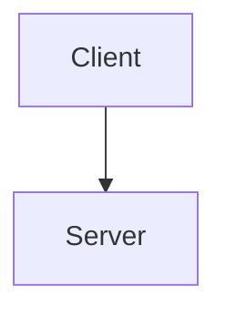
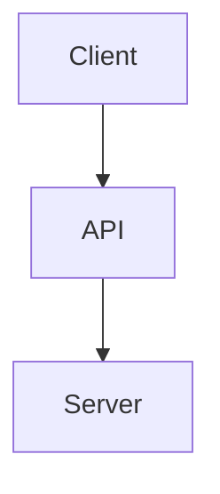

# API RESTful

## 362. What is REST?

REpresentational
State
Transfer

Arquitetura clássica da internet



Com API



API REST seria uma API com uma arquitetura diferente, outro exemplo seria SOAP, GraphQL e etc

 regras pra seguir para que sua API serja RESTful

> ​	useHTTP Request Verbs
>
> > get
> >
> > > read `app.get((){})`
> >
> > post
> >
> > > create `app.post((){})` 
> >
> > put
> >
> > > updates
> > >
> > > diferença entre patch: Put da todo o objeto inteiro no update, ao inves de uma parte só. Seria como trocar uma bicicleta com a roda quebrada ao invés de trocar so a roda.
> >
> > patch
> >
> > > ​	updates `app.patch((){})`
> > >
> > > diferença entre put: troca do parâmetro específico, so trcaria a roda da bicicleta ao inves dela inteira
> >
> > delete
> >
> > > app.delete((){})
>
> ​	use specific pattern of routes/endpoints URL's

### RESTful Routing

| HTTP Verbs |          /ARTICLES           |         /ARTICLES/JACK-BAUER          |
| :--------: | :--------------------------: | :-----------------------------------: |
|    GET     | fetches **all** new articles | fetches **the** article on jack-bauer |
|    POST    | creates **one** new article  |                   -                   |
|    PUT     |              -               | updates **the** article on jack-bauer |
|   PATCH    |              -               | updates **the** article on jack-bauer |
|   DELETE   | delete **all** the articles  | deletes **the** article on jack-bauer |

## 363. Creating a Database with Robo 3T

baixar o Studio 3T, ir em connect e criar nova conexão com valores default, muda o nome se quiser, mas a porta fica a mesma. Roda o mongo db no terminal antes de conectar. Conecta.

## 364. Set Up Server Challenge

challenge pra fazer o servidor

## 365. Set Up Server Solution

```js
const express = require("express");
const bodyParser = require("body-parser");
const ejs = require("ejs");
const mongoose = require('mongoose');

const app = express();

app.set('view engine', 'ejs');

app.use(bodyParser.urlencoded({
  extended: true
}));
app.use(express.static("public"));
//mongoose catch error
main().catch((err) => console.log(err));


async function main() {
    mongoose.connect("mongodb://localhost:27017/todoDB");


    app.listen(3000, function() {
        console.log("Server started on port 3000");
      });
}


```

## 366. GET All Articles


```js
const express = require("express");
const bodyParser = require("body-parser");
const ejs = require("ejs");
const mongoose = require('mongoose');
const app = express();
app.set('view engine', 'ejs');
app.use(bodyParser.urlencoded({
  extended: true
}));
app.use(express.static("public"));

//mongoose catch error
main().catch((err) => console.log(err));

async function main() {
    mongoose.connect("mongodb://localhost:27017/wikiDB");
    //schema
    const articleSchema = {
        title: String,
        content: String
    };
    //model
    const Article = mongoose.model("Article", articleSchema);
    //get articles
    app.get("/articles", function (req, res) {
        Article.find( (err, foundArticles) => {
            if (!err) {
                res.send(foundArticles);
            } else {
                res.send(err);
            }
        });
    });
    app.listen(3000, function() {
        console.log("Server started on port 3000");
      });
}
```

