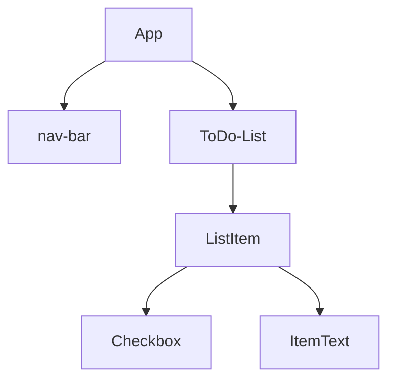

# React

## 391. What is React?

um framework javascript 

uma estrutura básica seria



um sistema de componentização que facilita a estrutura do codigo

## 392. What we will make in this React module

mostrando o que vai ser feito no capitulo

## 393. Introduction to Code Sandbox and the Structure of the Module

`https://codesandbox.io` online pra usar react e instalar dependencias faceis

falando que vao ser usado o codesandbox por um tempo depois passa pro vscode

fazer fork do projeto no seu github

## 394. Introduction to JSX and Babel

começa com instalando as dependencias de `react` e `react-dom`

no react tem o render, que tem a seguinte sintaxe

`ReactDOM.render("O QUE MOSTRAR", "ONDE MOSTRAR", callback());`

```html
<div id="root"></div>
```

```react
ReactDOM.render(<h1>Hello World</h1>, document.getElementById("root"));
```

um comparativo de vanilla dom pra react seria

```react
ReactDOM. render( <h1> Hello World </h1>, document.getElementById("root"));
                 
var h1 =
document.createElement("h1");
h1.innerHTML = "Hello World!";
document.getElementById("root").appendChild(h1);
```

**Babel faz uma conversão de um codigo JS para um que todos os navegadores possam entender**

o `.render()` so renderiza um elemento, mas quando quiser por 2 tem como usar `div` para ter somente um grande elemento HTML

```react
ReactDOM.render(
  <div>
    <h1>Hello World</h1>
    <p>Bem vindo</p>
  </div>,
  document.getElementById("root")
);
```

## 395. JSX Code Practice

fazer um pequeno site com h1 e uma lista nao ordenada usando react

```react
import React from "react";
import ReactDOM from "react-dom";

ReactDOM.render(
  <div>
    <h1>My favourite foods</h1>
    <ul>
      <li>French Fries</li>
    </ul>
  </div>,
  document.getElementById("root")
);
```

## 396. Javascript Expressions in JSX & ES6 Template Literals

falando sobre JSX deixar por html no JS, mas que pode tbm por JS dentro do HTML que está dentro do JS.

para chamar uma variável basta por {} com a variável dentro, assim como qualquer expressão.
_vídeo sobre expression x statement_

```react
const name = "Jefté"
ReactDOM.render(
  <div>
    <h1>Hello World, {name}</h1>
    <p>Bem vindo</p>
  </div>,
  document.getElementById("root")
);
```

## 397. Javascript Expressions in JSX Practice

```react
import React from "react";
import React DOM from "react-dom";
const name = "Angela";
const current Date = new Date();
const year = currentDate.getFullYear();
ReactDOM. render(
<div>
	<p>Created by {name}</p>
	<p>Copyright {year}</p>
</div>,
document.getElementById("root")
);
```

## 398. JSX Attributes & Styling React Elements

quando criando um html no `.render()` ao atribuir classe a um elemento nao deve se usar `class=""`, mas sim `className=""`

```react
<h1 className="NomeDaClasse">Conteúdo</h1>
```

ao fazer isso vc passa o JSX.
E ao passar JSX, haverá um erro no seu console ja que na tag <script></script> que importa o arquivo .js no seu html terá um `type=text/javascript`
nesse caso, deve-se mudar para `type="text/JSX"`

ao passar atributos cmo classe vc pode ajustar o css de acordo com as classes e ids que estão presentes no JSX e no arquivo do CSS

global atributes HTML, que podem ser usados em qualquer tag

## 399. Inline Styling for React Elements

para criar inline css tem que passar como um objeto

```react
 <h1 style={{ color: "red"}}>Hello World!</h1>.
```

