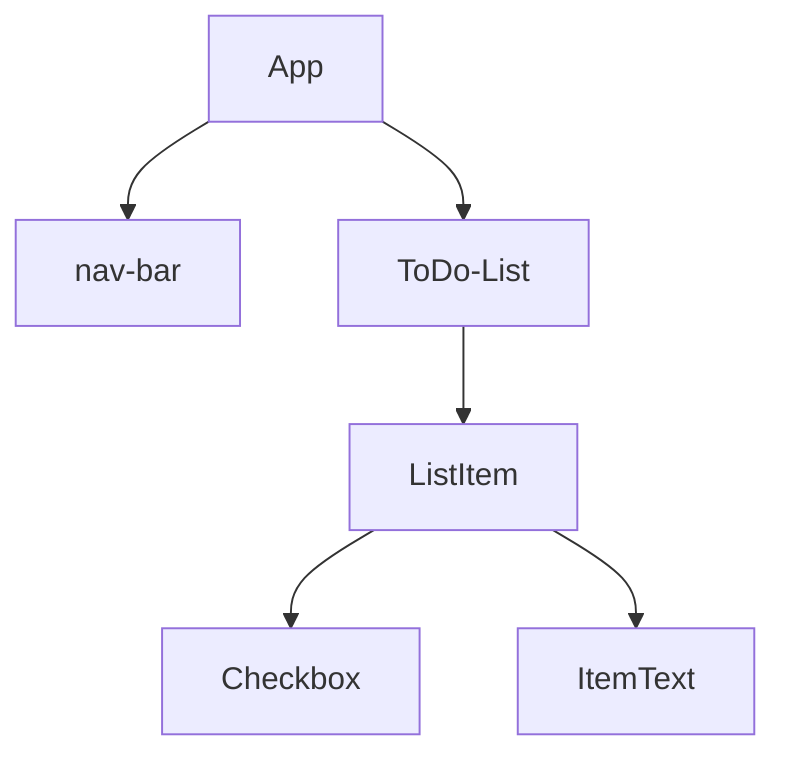
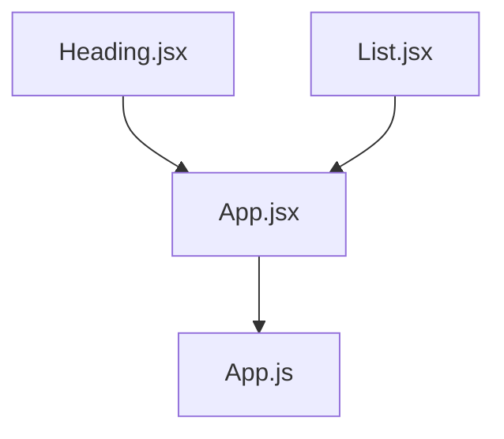

# React

## 391. What is React?

um framework javascript 

uma estrutura básica seria



um sistema de componentização que facilita a estrutura do codigo

## 392. What we will make in this React module

mostrando o que vai ser feito no capitulo

## 393. Introduction to Code Sandbox and the Structure of the Module

`https://codesandbox.io` online pra usar react e instalar dependencias faceis

falando que vao ser usado o codesandbox por um tempo depois passa pro vscode

fazer fork do projeto no seu github

## 394. Introduction to JSX and Babel

começa com instalando as dependencias de `react` e `react-dom`

no react tem o render, que tem a seguinte sintaxe

`ReactDOM.render("O QUE MOSTRAR", "ONDE MOSTRAR", callback());`

```html
<div id="root"></div>
```

```react
ReactDOM.render(<h1>Hello World</h1>, document.getElementById("root"));
```

um comparativo de vanilla dom pra react seria

```react
ReactDOM. render( <h1> Hello World </h1>, document.getElementById("root"));
                 
var h1 =
document.createElement("h1");
h1.innerHTML = "Hello World!";
document.getElementById("root").appendChild(h1);
```

**Babel faz uma conversão de um codigo JS para um que todos os navegadores possam entender**

o `.render()` so renderiza um elemento, mas quando quiser por 2 tem como usar `div` para ter somente um grande elemento HTML

```react
ReactDOM.render(
  <div>
    <h1>Hello World</h1>
    <p>Bem vindo</p>
  </div>,
  document.getElementById("root")
);
```

## 395. JSX Code Practice

fazer um pequeno site com h1 e uma lista nao ordenada usando react

```react
import React from "react";
import ReactDOM from "react-dom";

ReactDOM.render(
  <div>
    <h1>My favourite foods</h1>
    <ul>
      <li>French Fries</li>
    </ul>
  </div>,
  document.getElementById("root")
);
```

## 396. Javascript Expressions in JSX & ES6 Template Literals

falando sobre JSX deixar por html no JS, mas que pode tbm por JS dentro do HTML que está dentro do JS.

para chamar uma variável basta por {} com a variável dentro, assim como qualquer expressão.
_vídeo sobre expression x statement_

```react
const name = "Jefté"
ReactDOM.render(
  <div>
    <h1>Hello World, {name}</h1>
    <p>Bem vindo</p>
  </div>,
  document.getElementById("root")
);
```

para usar statement tem que escrever antes do render e jogar o resultado já dentro do `.render()`

## 397. Javascript Expressions in JSX Practice

```react
import React from "react";
import React DOM from "react-dom";
const name = "Angela";
const current Date = new Date();
const year = currentDate.getFullYear();
ReactDOM. render(
<div>
	<p>Created by {name}</p>
	<p>Copyright {year}</p>
</div>,
document.getElementById("root")
);
```

## 398. JSX Attributes & Styling React Elements

quando criando um html no `.render()` ao atribuir classe a um elemento nao deve se usar `class=""`, mas sim `className=""`

```react
<h1 className="NomeDaClasse">Conteúdo</h1>
```

ao fazer isso vc passa o JSX.
E ao passar JSX, haverá um erro no seu console ja que na tag <script></script> que importa o arquivo .js no seu html terá um `type=text/javascript`
nesse caso, deve-se mudar para `type="text/JSX"`

ao passar atributos cmo classe vc pode ajustar o css de acordo com as classes e ids que estão presentes no JSX e no arquivo do CSS

global atributes HTML, que podem ser usados em qualquer tag

## 399. Inline Styling for React Elements

para criar inline css tem que passar como um objeto

```react
 <h1 style={{ color: "red"}}>Hello World!</h1>.
```

outro exemplo de como passar e atualizar o objeto seria

```react
const customStyle = {
	color: "red",
	fontSize: "20px",
	border: "1px solid black"
}
customStyle.color = "blue":

ReactDOM. render(
	<h1 style={customStyle}>Hello World!</h1>,
	document.getElementById("root")
);
```

## 400. React Styling Practice

prática de estilização dando bom dia, boa tarde ou boa noite dependendo da hora

```react
import React from "react";
import ReactDOM from "react-dom";

const date = new Date();
const currentTime = date.getHours();

let greeting;

const customStyle = {
  color: ""
};

if (currentTime < 12) {
  greeting = "Good Morning";
  customStyle.color = "red";
} else if (currentTime < 18) {
  greeting = "Good Afternoon";
  customStyle.color = "green";
} else {
  greeting = "Good Night";
  customStyle.color = "blue";
}

ReactDOM.render(
  <h1 className="heading" style={customStyle}>
    {greeting}
  </h1>,
  document.getElementById("root")
);

//Create a React app from scratch.
//Show a single h1 that says "Good morning" if between midnight and 12PM.
//or "Good Afternoon" if between 12PM and 6PM.
//or "Good evening" if between 6PM and midnight.
//Apply the "heading" style in the styles.css
//Dynamically change the color of the h1 using inline css styles.
//Morning = red, Afternoon = green, Night = blue.

```

## 401. React Components

componentização seria como o EJS, arquivos separados de React seriam chamados em outro arquivo reunindo essas partes quando necessário. 



como fica o List

```react
import React from "react";

function List() {
  return (
    <ul>
      <li>Bacon</li>
      <li>Jamon</li>
      <li>Noodles</li>
    </ul>
  );
}

export default List;

```

como fica o Heading

```react
import React from "react";

function Heading() {
  return <h1>My Favourite Foods</h1>;
}

export default Heading;

```

como fica o app.jsx

```react
import React from "react";
import Heading from "./Heading";
import List from "./List";

function App() {
  return (
    <div>
      <Heading />
      <List />
      <List />
    </div>
  );
}

export default App;

```

como fica o index.js chamando o app.jsx

```react
import React from "react";
import ReactDOM from "react-dom";
import App from "./components/App";

ReactDOM.render(<App />, document.getElementById("root"));

```

## 402. React Components Practice

`https://codesandbox.io/s/react-components-practice-completed-2ksvn?fontsize=14&hidenavigation=1&theme=dark&file=/src/index.js`

## 403. Javascript ES6 - Import, Export and Modules

em um arquivo `src/math.js`, sendo src uma pasra de resources hipotética, há uma constante `const pi = 1.14159`

no final do arquivo há `export default pi;`

para acessar tal variável,  fazemos o import no começo do arquivo que queremos usar o pi

`import pi from ".math/js"`

basicamente da mesma forma que se cria um package interno do express

mas como faria com mais de 1 dado?

```js
const pi = 3.1415962;
function doublePi() {
return pi* 2;
function triplePi() {
return pi * 3;
export default pi;
export {doublePi, tripleP}:


```

```react
import React from "react";
import ReactDOM from "react-dom";
import PI, {doublePi, triplePi} from ". /math.js":
// PI pode ser qualquer coisa, mas as variáveis dentro dos colchetes tem que ser a mesma do arquivo a ser exportado
ReactDOM. render(
	<ul>
		<li>{PI}</1i>
		<li>{doublePi()}</li>
		<li>{triplePi()}</li>

</ul>,
document.getElementById("root")
);
//pi era uma variavel e as outras 2 eram metodos
```

ou de forma mais fácil, usar `import * as pi from "./math.js";` e chamar as variaveis como `pi.default`, para o valor de pi e `pi.doublePi()` para o método de pi*2

## 404. Javascript ES6 Import, Export and Modules Practice

```react
import React from "react";
import ReactDOM from "react-dom";
import { add, subtract, multiply, divide } from "./calculator";


ReactDOM.render(
  <ul>
    <li>{add(1, 2)}</li>
    <li>{multiply(2, 3)}</li>
    <li>{subtract(7, 2)}</li>
    <li>{divide(5, 2)}</li>
  </ul>,
  document.getElementById("root")
);

```

## 405. [Windows] Local Environment Setup for React Development

no terminal digitar `npx create-react-app my-app`

ir na pasta `my-app` e rodar `npm start`

o hello world

```react
import React from 'react';
import ReactDOM from 'react-dom/client';

const root = ReactDOM.createRoot(document.getElementById('root'));
root.render(
  <h1>Hello, world!</h1>
);
```

## 408. Keeper App Project - Part 1 Challenge

 //1. Create a new React app.
//2. Create a App.jsx component.
//3. Create a Header.jax component that renders a `<header>` element
//to show the Keeper App name in an <h1>.
//4. Create a Footer.jsx component that renders a `<footer>` element
//to show a copyright message in a <p> with a dynamically updated year.
//5. Create a Note.jsx component to show a <div> element with a
//`<h1>` for a title and a `<p>` for the content.
//6. Make sure that the final website is styled like the example shown here:
//https://w00gz.csb.app/
//HINT: You will need to study the classes in teh styles.cos file to appy styling.

## 410. React Props

faland sobre elementos repetitivos e como react é útil pra isso

os componentes, `<component />`, podem receber propriedades como um elemento HTML e passar esses valores pra função que faz aquele componente, como uma função que recebe parametros.

```react
function Card(props) {
  return (
    <div>
      <h2>{props.name}</h2>
      
      <p>{props.tel}</p>
      <p>{props.email}</p>
    </div>
  );
}

ReactDOM.render(
  <div>
    <h1>My Contacts</h1>
    <Card
      name="Beyonce"
      img="https://blackhistorywall.files.wordpress.com/2010/02/picture-device-independent-bitmap-119.jpg"
      tel="+123 456 789"
      email="b@beyonce.com"
    />
    <Card
      name="Jack Bauer"
      img="https://pbs.twimg.com/profile_images/625247595825246208/X3XLea04_400x400.jpg"
      tel="+7387384587"
      email="jack@nowhere.com"
    />
  </div>,
  document.getElementById("root")
);

```

## 411. React Props Practice

usando props com um objeto js de uma outra pasta

`https://codesandbox.io/s/react-props-practice-completed-c6fkx?fontsize=14&file=/src/components/App.jsx`

## 412. React DevTools

extensão `React DevTools`

`https://codesandbox.io/s/react-devtools-completed-wku4k?fontsize=14&file=/src/components/Card.jsx`

codigo final outro exemplo de componentização

## 413. Mapping Data to Components

```jsx
import React from "react";
import Card from "./Card";
import contacts from "../contacts";

function createCard(contact) {
  return (
    <Card
      key={contact.id} // contact é o arquivo externo
      name={contact.name}
      img={contact.imgURL}
      tel={contact.phone}
      email={contact.email}
    />
  );
}

function App() {
  return (
    <div>
      <h1 className="heading">My Contacts</h1>
      {contacts.map(createCard)}
    </div>
  );
}

export default App;

```

## 414. Mapping Data to Components Practice

pegar as partes que repetem pra fazer o componente
criar propriedades

**passo 1** - Criar componente da parte que repete:

```jsx
import React from "react";

function Entry(props) {
  return (
    <div className="term">
      <dt>
        <span className="emoji" role="img" aria-label="Tense Biceps">
          💪
        </span>
        <span>Tense Biceps</span>
      </dt>
      <dd>
        “You can do that!” or “I feel strong!” Arm with tense biceps. Also used
        in connection with doing sports, e.g. at the gym.
      </dd>
    </div>
  );
}
export default Entry;

```

```jsx
import React from "react";
import emojipedia from "../emojipedia.js";
import Entry from "./Entry";

function App() {
  return (
    <div>
      <h1>
        <span>emojipedia</span>
      </h1>
      <dl className="dictionary">
        <Entry />
      </dl>
    </div>
  );
}

export default App;

```

**passo 2** - fazer o entry receber as propriedades:

```jsx
//entry
import React from "react";

function Entry(props) {
  return (
    <div className="term">
      <dt>
        <span className="emoji" role="img" aria-label="Tense Biceps">
          {props.emoji}
        </span>
          <span>{props.name}</span>
      </dt>
      <dd>{props.description}</dd>
    </div>
  );
}
export default Entry;

```

```jsx
//App
import React from "react";

function Entry(props) {
  return (
    <div className="term">
      <dt>
        <span className="emoji" role="img" aria-label="Tense Biceps">
          {props.emoji}
        </span>
          <span>{props.name}</span>
      </dt>
      <dd>{props.description}</dd>
    </div>
  );
}
export default Entry;

```

Até o momento ja mostra o card

passo 3 - Criar a função de exibit card e um map do emojipedia

```jsx
import React from "react";
import emojipedia from "../emojipedia.js";
import Entry from "./Entry";

function createCard(emojipedia) {
  return (
    <Entry
      key={emojipedia.id}
      emoji={emojipedia.emoji}
      name={emojipedia.name}
      description={emojipedia.meaning}
    />
  );
}

function App() {
  return (
    <div>
      <h1>
        <span>emojipedia</span>
      </h1>
      <dl className="dictionary">{emojipedia.map(createCard)}</dl>
    </div>
  );
}

export default App;

```

