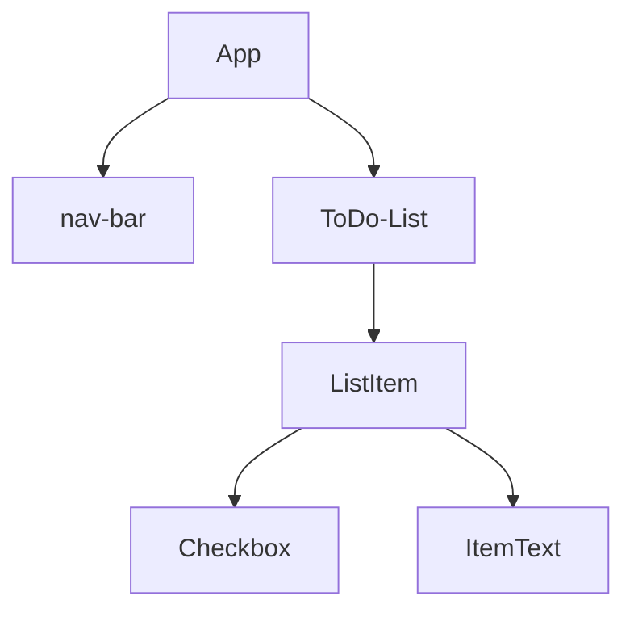

# React

## 391. What is React?

um framework javascript 

uma estrutura básica seria

um sistema de componentização que facilita a estrutura do codigo

## 392. What we will make in this React module

mostrando o que vai ser feito no capitulo